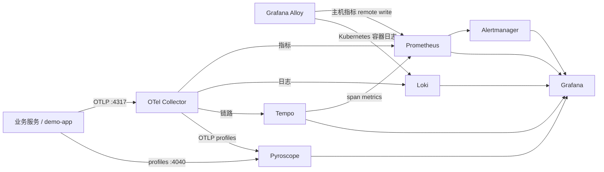
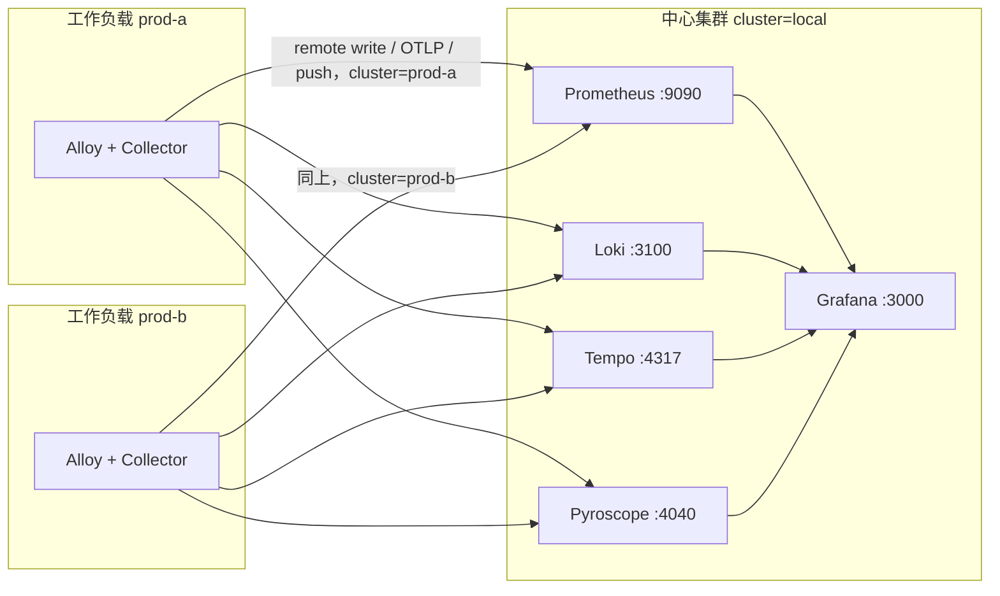

# 可观测性平台

这是一套可以真正拉起来的可观测性基础设施：指标、日志、链路、Profile、采集、告警和仪表盘都在仓库里，用同一批配置同时服务本机 Docker Compose 和 Kubernetes（Kustomize）。技术选型是 OpenTelemetry 原生的 Grafana LGTM：Collector / Alloy、Prometheus、Loki、Tempo、Pyroscope、Grafana、Alertmanager。

## 1. 这个仓库是什么

适用场景：

- 在一台机器上把整套信号打通，确认应用接法、告警表达式和仪表盘。
- 把同一份配置推进到一个 Kubernetes 命名空间，作为单副本、本地盘的起步环境。
- 给还没有观测接入的服务一份对照实现：`examples/demo-app`。它现在同时代表 ToC（`toc-api`、`toc-checkout`）和 ToB（`tob-admin`、`tob-billing`，租户 `acme`）。目录在 `config/tenancy.yaml`，说明在 [docs/tenancy.md](docs/tenancy.md)。

不做什么：

- 不是多副本、不是对象存储、不是跨可用区。Loki / Tempo / Pyroscope / Prometheus 都是单进程。多集群指的是多个工作负载集群把数据送到这一套中心栈，不是把中心栈拆成多副本。
- 不在组件之间做 mTLS，也不给 remote write 加鉴权。中心端点必须放在可达的内网里，不要暴露到公网。
- 不内置某个云厂商的托管后端，也不把上游 Helm chart 的 tarball 塞进仓库。
- 不替代应用自己的 OpenTelemetry SDK。Collector 只负责接收和转发。

## 2. 架构总览



更细的职责划分、标签约定和「为什么 Compose 与 Kubernetes 能共用配置」写在 [docs/architecture.md](docs/architecture.md)。多集群的标签合同、网络路径和排障写在 [docs/multi-cluster.md](docs/multi-cluster.md)。多业务线和租户在 [docs/tenancy.md](docs/tenancy.md)。

### 多集群

一套中心栈，加上任意多个工作负载集群，同时观察多条业务线。工作负载集群不跑 Prometheus / Loki / Tempo / Pyroscope / Grafana。它们只跑 Alloy 和 Collector，把指标、日志、链路、Profile 送到中心端点，并带上低基数标签 `cluster`、`business_line` 和 `tenant`。日志和链路再按 `X-Scope-OrgID` 进入不同 org。ToC 的租户是 `consumer`。ToB 的租户来自允许表（`acme`、`northwind`），不会把两个企业客户或 ToB 与 ToC 加在一起。



Compose 仍然是一台机器上的中心栈，`cluster` 固定为 `local`。Agent 配置里的环境变量和 Kubernetes 工作负载集群是同一条管道，只是 URL 指向 Docker 网络里的服务名。

清单仍然是 `config/` 和 `deploy/kubernetes` 里的 YAML。Kustomize 负责把同一批文件渲染成 ConfigMap。Terraform 是下发入口：`deploy/terraform/stacks/platform` 用 `for_each` 调用 `modules/cluster_agent`，用 provider alias 绑定每个集群的 kubeconfig。增加第三个集群改的是变量和一行 alias，不是再复制一份 Deployment。步骤在 [deploy/terraform/README.md](deploy/terraform/README.md)。

五层监控和运维说明：

| 文档 | 内容 |
| --- | --- |
| [docs/metrics-catalog.md](docs/metrics-catalog.md) | 五层指标：名字、类型、标签、来源、PromQL、告警、仪表盘 |
| [docs/debugging.md](docs/debugging.md) | 没有点、抓取失败、没有日志 / 链路 / Profile、告警不响、Collector 导出失败 |
| [docs/onboarding.md](docs/onboarding.md) | OTLP、抓取、远程写、Loki、中间件 exporter、业务仪器和标签允许表 |
| [docs/processing.md](docs/processing.md) | Collector 处理器、记录规则、Loki 限制、保留时间 |
| [docs/data-skew.md](docs/data-skew.md) | 高基数、热点、日志流、采样偏差、丢弃，以及仓库里的改前改后配置 |
| [docs/slo.md](docs/slo.md) | HTTP 可用性与延迟的多窗口烧录 |

本地发布端口全部绑在 `127.0.0.1`。容器内部仍然监听 `0.0.0.0`，这样同一 Docker 网络里的组件能互相访问。

| 组件 | 容器端口 | 本机地址 | 用途 |
| --- | --- | --- | --- |
| Grafana | 3000 | http://127.0.0.1:3000 | UI |
| Demo | 8080 | http://127.0.0.1:8080 | 示例业务 |
| OTel Collector gRPC | 4317 | 127.0.0.1:4317 | 应用 OTLP |
| OTel Collector HTTP | 4318 | 127.0.0.1:4318 | 应用 OTLP |
| Prometheus | 9090 | http://127.0.0.1:9090 | 指标、规则 |
| Alertmanager | 9093 | http://127.0.0.1:9093 | 告警 |
| Loki | 3100 | http://127.0.0.1:3100 | 日志 |
| Tempo | 3200 | http://127.0.0.1:3200 | 查询链路。OTLP 4317/4318 不映射到宿主机 |
| Pyroscope | 4040 | http://127.0.0.1:4040 | Profile，同时收 OTLP gRPC |
| Alloy UI | 12345 | http://127.0.0.1:12345 | 节点代理 |
| Collector 自身指标 | 8888 | http://127.0.0.1:8888/metrics | 管道健康 |
| Collector 健康检查 | 13133 | http://127.0.0.1:13133 | 存活 |
| Collector zpages | 55679 | http://127.0.0.1:55679/debug/tracez | 导出排障 |
| node_exporter | 9100 | http://127.0.0.1:9100/metrics | 主机指标，job `node` |
| Redis | 6379 | 127.0.0.1:6379 | 中间件目标 |
| redis_exporter | 9121 | http://127.0.0.1:9121/metrics | Redis 指标 |
| PostgreSQL | 5432 | 127.0.0.1:5432 | 中间件目标，本地 trust，无密码 |
| postgres_exporter | 9187 | http://127.0.0.1:9187/metrics | PostgreSQL 指标 |
| Nginx | 8080 | http://127.0.0.1:8088 | 反代 demo。stub_status 不对宿主机开放 |
| nginx_exporter | 9113 | http://127.0.0.1:9113/metrics | Nginx 连接和请求速率 |
| Kafka | 9092 | 127.0.0.1:9092 | 单节点 KRaft |
| kafka_exporter | 9308 | http://127.0.0.1:9308/metrics | broker 数和消费延迟 |

### 版本

镜像标签以 [deploy/images.env](deploy/images.env) 为准，`make config-check` 会核对 Compose 和 Kustomize 里出现了同一批标签。Collector `0.162.0` 在 2026-09-29 打了 git tag，但 Docker Hub 上还没有对应镜像，因此钉在已发布的 `0.161.0`。

| 组件 | 镜像 | 版本 |
| --- | --- | --- |
| OpenTelemetry Collector Contrib | `otel/opentelemetry-collector-contrib` | 0.161.0 |
| Grafana Alloy | `grafana/alloy` | v1.20.1 |
| Prometheus | `prom/prometheus` | v3.15.0 |
| Alertmanager | `prom/alertmanager` | v0.34.1 |
| Loki | `grafana/loki` | 3.7.8 |
| Tempo | `grafana/tempo` | 3.0.3 |
| Pyroscope | `grafana/pyroscope` | 2.3.1 |
| Grafana | `grafana/grafana` | 13.2.3 |
| Demo 基础镜像 | `python` | 3.12.12-slim |
| Demo OTel SDK | `opentelemetry-sdk` 等 | 1.45.0（instrumentation `0.66b0`） |
| Demo Pyroscope SDK | `pyroscope-io` / `pyroscope-otel` | 1.2.4 / 1.1.0 |
| node_exporter | `prom/node-exporter` | v1.9.1 |
| Redis | `redis` | 7.4.6 |
| redis_exporter | `oliver006/redis_exporter` | v1.74.0 |
| PostgreSQL | `postgres` | 17.6 |
| postgres_exporter | `prometheuscommunity/postgres-exporter` | v0.17.1 |
| Nginx | `nginx` | 1.28.0 |
| nginx_exporter | `nginx/nginx-prometheus-exporter` | 1.4.2 |
| Kafka | `apache/kafka` | 3.9.1 |
| kafka_exporter | `danielqsj/kafka-exporter` | v1.9.0 |
| kube-state-metrics | `registry.k8s.io/kube-state-metrics/kube-state-metrics` | v2.16.0（仅 Kubernetes） |

## 3. 目录结构

```text
config/tenancy.yaml         业务线、租户、服务和集群落点。生成器读这份文件
config/otel-collector/     Collector 网关配置
config/alloy/              本地 config.alloy 与 Kubernetes config.k8s.alloy
config/prometheus/         prometheus.yml、告警、记录规则、promtool 测试
config/alertmanager/       路由、抑制、接收器
config/loki/               单二进制 Loki
config/tempo/              单二进制 Tempo
config/pyroscope/          单二进制 Pyroscope
config/grafana/            数据源、仪表盘提供者、告警 provisioning、仪表盘 JSON
config/nginx/              Nginx 反代与 stub_status，Compose 和 Kubernetes 共用
config/redis/              Redis maxmemory，供内存饱和告警
examples/demo-app/         已接入 OTel 的示例服务，含业务指标
deploy/docker-compose/     本地全栈
deploy/kubernetes/         Kustomize base、dev/prod overlay、agent 工作负载清单
deploy/terraform/          中心栈与多集群 agent 的 Terraform 入口
deploy/images.env          镜像钉扎清单
docs/                      架构、多集群、租户、五层指标目录、接入、处理、倾斜、排障、SLO
scripts/config-check.sh    配置校验
```

Compose 用 bind mount，Kustomize 用 `configMapGenerator` 指向这些文件。改配置只改 `config/`，不要在 `deploy/` 里再复制一份。

## 4. 前置条件

本地：

- Docker Engine 与 Docker Compose v2
- 能挂载宿主机的 `/proc`、`/sys`、`/`（只读）给 Alloy，用来采主机指标
- `make`、`python3`、`curl`

校验配置（不必真正启动集群）：

- `promtool`（随 Prometheus 3.15.0 发布）
- `amtool`（随 Alertmanager 0.34.1 发布）
- `kustomize` 5.x
- `alloy` v1.20.1，可选但脚本会用它检查 River
- `otelcol-contrib` 0.161.0，可选，用来 `validate`
- Python 包 `pyyaml`，以及 demo 的 `requirements.txt`

Kubernetes：

- 集群有默认 StorageClass（清单里的 PVC 不写 storageClassName）
- 允许 baseline Pod Security：Alloy 需要 hostPath，并以 root 读主机指标
- 构建并载入 `demo-app:local`（见第 8 节）

## 5. 本地一键拉起

```bash
make up
```

等价于：

```bash
docker compose \
  -f deploy/docker-compose/docker-compose.yml \
  -f deploy/docker-compose/businesses.yml \
  up -d --build
```

第一次会构建 demo 镜像。看状态：

```bash
make ps
make logs
```

Grafana：打开 http://127.0.0.1:3000 。默认账号密码是 `admin` / `admin`，只适合本机。要用别的密码：

```bash
cp deploy/docker-compose/.env.example deploy/docker-compose/.env
# 编辑 GF_SECURITY_ADMIN_PASSWORD 后重新 make up
```

`.env` 已被 gitignore。不创建 `.env` 时 Compose 使用文件里的默认值 `admin`。

打一小波流量：

```bash
make load
# 或者
curl -sS http://127.0.0.1:8080/api/work
curl -sS -o /dev/null -w "%{http_code}\n" http://127.0.0.1:8080/api/error
```

预期能看到：

- Grafana 文件夹 **Observability** 里有 Overview、Logs、Traces、Profiles、Host and containers、Demo app，以及五层仪表盘 Infrastructure、Middleware、Application RED、Business、Observability pipeline。
- **Demo app** 仪表盘上 `service_name="toc-api"`、`tenant="consumer"` 的 QPS、错误率和 p95。指标大约每 5 秒导出一次。ToB 看仪表盘 **ToB 业务线**。
- **Logs** 里 `{service_name="toc-api", tenant="consumer"}` 的 JSON 行（数据源 uid `loki` 是 org `toc`）。点开带 `trace_id` 的行可以跳到 Tempo。
- **Traces** 里 TraceQL `{ resource.service.name = "toc-api" && resource.tenant = "consumer" }`。`/api/error` 的 span 状态是 ERROR。
- **Profiles** 里 `service_name` 为 `toc-api`、`tenant` 为 `consumer` 的 CPU 火焰图。`/api/work` 会调用 `burn_cpu`，栈上应该能看到它。
- Prometheus http://127.0.0.1:9090 规则页能看到 `TargetDown`、`HighErrorRate` 等。Alertmanager http://127.0.0.1:9093 能看到触发的告警，但默认不外发。

停掉并保留数据卷：

```bash
make down
```

`make down` 不删卷。要连数据一起删：`docker compose -f deploy/docker-compose/docker-compose.yml down -v`。

## 6. 每个组件怎么配置

下面只列你会改的开关。完整文件在对应目录，注释写了不要做的事（例如把单二进制配置扩成多副本）。

### OpenTelemetry Collector

文件：`config/otel-collector/config.yaml`。

- `receivers.otlp`：gRPC `4317`、HTTP `4318`，这是应用唯一需要知道的入口。
- `processors.memory_limiter`：按容器内存百分比限流，必须放在 pipeline 的第一个 processor。内存不够时会丢数据，并触发 `CollectorRefusedData`。
- `processors.batch`：5 秒或 1024 条打包一次。profiles 管道不用 batch。
- `processors.attributes/sanitize`：删除 `user.id`、`order.id`、原始 URL 一类键。
- `processors.filter/query_in_route`：丢掉 `http.route` 里带查询串的数据。
- `processors.transform/business_labels`：把业务标签收回到允许表。
- `processors.tail_sampling`：错误和慢 trace 全留，其余目前 100% 采样，导出晚 5 秒。细节在 [docs/processing.md](docs/processing.md)。
- `exporters.prometheusremotewrite`：写入 `http://prometheus:9090/api/v1/write`，并把资源属性转成标签。
- `exporters.otlphttp/loki`：基址 `http://loki:3100/otlp`，Collector 会再拼上 `/v1/logs`。
- `exporters.otlp/tempo`：`tempo:4317`。
- `exporters.otlp/pyroscope`：`pyroscope:4040`。Pyroscope 只在这个端口上收 OTLP **gRPC**，不收 OTLP HTTP。
- profiles 管道在 0.161 仍要 feature gate。Compose 和 Deployment 的参数里已经带了 `--feature-gates=service.profilesSupport`。去掉 profiles 管道才能去掉这个参数。

自身指标在 `8888`（本机 http://127.0.0.1:8888/metrics ），给 Prometheus job `otel-collector` 抓。健康检查在 `13133`，zpages 在 `55679`。`telemetry.metrics.level` 是 `detailed`，队列长度才有数。

### Alloy

- 本地：`config/alloy/config.alloy`。`prometheus.exporter.unix` 读 `/host/proc`、`/host/sys`、`/host/root`，remote write 到 Prometheus，job 名是 `alloy-unix`。主机仪表盘读 node_exporter 的 job `node`。OTLP 接收器转发给 Collector，demo 默认不走这里。
- Kubernetes：`config/alloy/config.k8s.alloy`。额外做两件事：只采集 `NODE_NAME` 上的 Pod 日志并推到 Loki；通过 API server 代理抓本节点 cAdvisor。证书用 ServiceAccount 的 CA，不跳过 TLS。

三份 Alloy 配置都从环境变量读取 `PROMETHEUS_REMOTE_WRITE_URL`、`LOKI_PUSH_URL` 和 `CLUSTER_NAME`。Compose 把它们设成 `http://prometheus:9090/api/v1/write`、`http://loki:3100/loki/api/v1/push` 和 `local`。中心集群的 ConfigMap `observability-endpoints` 用同一组默认值。工作负载集群由 Terraform 写入该集群自己的名字和中心 URL。`config/alloy/config.workload.alloy` 额外按节点抓取 node-exporter，job 名是 `node`。

### Prometheus

文件：`config/prometheus/prometheus.yml`。

- 抓取间隔 15 秒。抓的是平台组件，不是 demo。应用 RED 指标来自 remote write。
- `scrape_native_histograms` 与 `always_scrape_classic_histograms` 同时打开。Prometheus 3.15 已经不能再用 `--enable-feature=native-histograms`。
- `--enable-feature=exemplar-storage` 和 `storage.exemplars.max_exemplars` 让指标上的 trace id 能跳到 Tempo。
- `--web.enable-remote-write-receiver` 必须留着，否则 Collector 和 Tempo 的 remote write 会被拒绝。
- 保留时间 `--storage.tsdb.retention.time=15d`。磁盘告警看的是 Alloy 报上来的 `node_filesystem_*`。
- 规则目录 `/etc/prometheus/rules/*.yml`。

### Alertmanager

文件：`config/alertmanager/alertmanager.yml`。路由、抑制和怎么加接收人见第 9 节。

### Loki

文件：`config/loki/loki.yaml`。单进程、TSDB、文件系统、`auth_enabled: true`。每个写入和查询都要带 `X-Scope-OrgID`。org 来自 `config/tenancy.yaml`：`toc`、`tob-acme`、`tob-northwind`、`platform`、`rejected`。`/metrics` 和 `/ready` 不走这道认证。

- `limits_config.retention_period: 168h`，compactor 打开 retention。
- OTLP 资源属性 `service.name`、`service.namespace`、`deployment.environment`、`cluster`、`tenant`、`business_line` 提升为索引标签，点号会变成下划线，所以 LogQL 写 `{service_name="toc-api", tenant="consumer"}`。查询必须带该 org 的 `X-Scope-OrgID`。
- `pattern_ingester` 按上游本地配置打开，用来做日志模式聚合。不需要可以设 `enabled: false`。
- 多副本、对象存储、成员列表不要改这个文件硬上。用 Grafana Loki Helm chart（社区仓库 `grafana-community/helm-charts`，chart 默认仍是单体模式，生产再改成 scalable）。

### Tempo

文件：`config/tempo/tempo.yaml`。`-target=all`，本地块存储，`multitenancy_enabled: true`。Collector 按租户把 `X-Scope-OrgID` 送到 OTLP。span metrics 的维度包含 `cluster`、`tenant`、`business_line`。

- OTLP 听在 `0.0.0.0:4317/4318`，避免 Kubernetes 里 Pod 主机名不是 `tempo` 时绑不上端口。
- 块保留使用 Tempo 3 的默认 14 天。`backend_worker.compaction.block_retention` 可以改这个值，但单二进制本地模式没有 backend scheduler，不要在这份文件里单独打开 worker。
- `metrics_generator` 生成 span metrics 和 service graph，remote write 回 Prometheus。Grafana 的 Traces 仪表盘读 `traces_spanmetrics_*` 和 `traces_service_graph_request_total`。
- 分布式 Tempo 用上游 Tempo Helm chart。Tempo 3 的写入路径和 2.x 不兼容，升级前看官方迁移说明。

### Pyroscope

文件：`config/pyroscope/config.yaml`。数据目录放在镜像自带的 `/data`（uid 10001）下面。`architecture_storage` 保持二进制默认的 `v1-v2-dual`，和上游 Docker 示例一致。

- 摄取速率 `ingestion_rate_mb` / `ingestion_burst_size_mb`。Demo 很小，调大只在大量持续 profiling 时需要。
- v1 路径的块保留 `compactor_blocks_retention_period: 168h`。
- 微服务和对象存储用 Grafana Pyroscope Helm chart（2.1 之后默认 v2 存储）。

### Grafana

Provisioning 在 `config/grafana/provisioning/`。

- 数据源 UID：`prometheus` 仍是一套，靠标签区分租户。`loki` 和 `tempo` 固定查 org `toc`。ToB 每个租户另有 `loki-tob-acme`、`tempo-tob-acme`、`loki-tob-northwind`、`tempo-tob-northwind`。基础设施日志是 `loki-platform`。配错的租户在 `loki-rejected` 和 `tempo-rejected`。头里的值是 org id，不是密码。
- Tempo 数据源配置了 traces 到 logs、profiles、metrics 的跳转，以及 service map。
- Loki 派生字段用正则 `"trace_id":"([0-9a-f]+)"` 跳到 Tempo。
- 匿名访问关闭，不允许注册。功能开关 `traceToProfiles` 和 `tracesEmbeddedFlameGraph` 用来从 trace 看火焰图。

## 7. 应用接入

约定与语言无关：

1. 资源属性至少设置 `service.name`、`service.namespace`、`deployment.environment`。本仓库的 namespace 固定为 `observability`。
2. Exporter 使用 OTLP。集群内地址是 `http://otel-collector:4317`（gRPC）。本机进程访问 Compose 时用 `http://127.0.0.1:4317`。
3. HTTP 服务端延迟使用语义约定直方图 `http.server.request.duration`，单位秒。属性用 `http.route`、`http.request.method`、`http.response.status_code`。不要把完整 URL 当标签。
4. 日志打成 JSON，并带上当前 span 的 `trace_id` / `span_id`。同时用 OTLP log exporter，这样日志走 Collector，而不是只靠捞 stdout。
5. Profile：已经能发 OTLP profiles 的运行时指向 Collector `4317`。Python / Go 的 Pyroscope SDK 则设置 `PYROSCOPE_SERVER_ADDRESS=http://pyroscope:4040`，应用名与 `service.name` 相同，并加标签 `service_name`。
6. 健康检查路径如果会高频调用，在 SLO 规则里排除。本仓库排除的是 `/healthz`。

Demo 对照（`examples/demo-app`）：

| 环境变量 | 含义 |
| --- | --- |
| `OTEL_SERVICE_NAME` | 资源属性 `service.name`。Compose 的 ToC api 是 `toc-api`。未设置时单测默认 `demo-app` |
| `BUSINESS_LINE` | `toc` 或 `tob`。未设置时按 `toc` |
| `TENANT_ID` | ToC 会被收成 `consumer`。ToB 只能是允许表里的 id，否则标签是 `rejected`，原始字符串不会留下 |
| `SERVICE_ROLE` | `api`、`checkout`、`admin`、`billing` |
| `OTEL_EXPORTER_OTLP_ENDPOINT` | 例如 `http://otel-collector:4317` |
| `OTEL_METRIC_EXPORT_INTERVAL` | 毫秒，本地默认 5000 |
| `DEPLOYMENT_ENVIRONMENT` | 资源属性 `deployment.environment` |
| `PYROSCOPE_SERVER_ADDRESS` | 空则不推 profile |
| `OTEL_ENABLED` | `false` 时 SDK 不导出，单测用 |

路由：

| 路径 | 行为 |
| --- | --- |
| `GET /healthz`、`GET /` | 200。`/healthz` 不计入 SLO |
| `GET /api/work?burn_ms=40` | 200，并烧一段 CPU |
| `GET /api/slow?seconds=0.8` | 200，用来拉高延迟。`seconds` 最大 5 |
| `GET /api/error` | 500 |
| `GET /api/orders?channel=web` | 200，记 `business_orders_created_total`。channel 只允许 `web`、`api`，其他收成 `other` |
| `GET /api/checkout?method=card&fail=0&segment=anonymous&delay_ms=0` | 200。记支付结果、结账延迟和活跃用户。`fail=1` 仍是 HTTP 200，失败写在业务指标的 `result="failure"`。ToC api 和 `toc-checkout`（`:8081`）都提供 |
| `GET /api/invoices?fail=0` | ToB billing（Compose `:8083`，租户 `acme`）。记 `business_invoices_total` |
| `GET /api/seats?plan=standard&count=1&limit=100` | ToB admin（`:8082`）。记席位占用，`plan` 只允许 `standard`、`enterprise` |
| `GET /api/quota?class=standard&used=0&limit=1000` | ToB admin。记 API 配额。`used` 和 `limit` 是数值，不是标签 |

业务标签允许表和 Collector 里的改写规则在 [docs/onboarding.md](docs/onboarding.md)。不要把用户 id 或订单 id 加进标签。

实现分两处：`examples/demo-app/src/demo_app/telemetry.py` 负责 Resource、OTLP exporter、直方图 bucket（含 0.3 秒）和 Pyroscope；`server.py` 负责路由、span 状态和 JSON 日志。

## 8. Kubernetes 部署

清单在 `deploy/kubernetes`。`base` 引用 `config/` 生成 ConfigMap。`overlays/dev` 把几块盘降到 2Gi，环境标成 `dev`。`overlays/prod` 加大请求/限制和磁盘，并把 demo 的环境标成 `prod`。两边都是单副本，并且都是完整的中心栈。工作负载集群用 `deploy/kubernetes/agent`，只包含 Alloy、Collector、node-exporter、kube-state-metrics 和 NetworkPolicy。

多集群的管理入口是 Terraform，不是把下面的 `kubectl apply` 复制到每台机器上。`kubectl` 仍然是 Terraform 内部用来应用 Kustomize 输出的工具。只想在一个集群上看 YAML 时，可以继续用本节的命令。

```bash
cd deploy/terraform/stacks/platform
cp terraform.tfvars.example terraform.tfvars
# 编辑 kubeconfig 路径。不要把 kubeconfig 或密码提交到 git。
terraform init
terraform plan
terraform apply
```

`make terraform-check` 会 `terraform fmt -check`、`init -backend=false` 和 `validate`。`make config-check` 会调用它。详细的 init、plan、apply、远端状态、按集群销毁见 [deploy/terraform/README.md](deploy/terraform/README.md)。

先创建 Grafana 管理员 Secret（不要写进 git）：

```bash
kubectl create namespace observability --dry-run=client -o yaml | kubectl apply -f -
kubectl -n observability create secret generic grafana-admin \
  --from-literal=admin-user=admin \
  --from-literal=password='用你自己的密码替换'
```

构建 demo 并载入到集群运行时能看到的位置：

```bash
docker build -t demo-app:local examples/demo-app
# kind: kind load docker-image demo-app:local
# minikube: minikube image load demo-app:local
```

部署：

配置在仓库的 `config/`，不在 `deploy/kubernetes/` 里面。Kustomize 默认禁止引用根目录之外的文件，所以要关掉这道限制，Compose 和集群才能继续共用同一份文件：

```bash
kustomize build --load-restrictor LoadRestrictionsNone deploy/kubernetes/overlays/dev | kubectl apply -f -
kubectl -n observability get pods
```

`kubectl apply -k` 没有这个开关，直接用会拒绝生成 ConfigMap。生产 overlay 把 `dev` 换成 `prod`。

Grafana 的 Deployment 引用这个 Secret。Secret 不存在时 Pod 会停在 `CreateContainerConfigError`，这是故意的，避免集群上静默使用 `admin/admin`。

看 UI：

```bash
kubectl -n observability port-forward svc/grafana 3000:3000
```

应用如果跑在别的命名空间，把 OTLP 指到 `otel-collector.observability.svc:4317`。NetworkPolicy 允许任意命名空间访问 4317、4318、Grafana 3000 和 demo 8080，命名空间内部互通，出站目前放行（要访问 API server 和 DNS）。

存储与资源（base）：

| 组件 | PVC | 内存 limit | 说明 |
| --- | --- | --- | --- |
| Prometheus | 10Gi | 2Gi | 保留 15 天 |
| Loki | 20Gi | 2Gi | 保留 7 天 |
| Tempo | 20Gi | 2Gi | 默认保留 14 天 |
| Pyroscope | 10Gi | 2Gi | 块保留 7 天 |
| Grafana | 2Gi | 512Mi | sqlite 与插件数据 |
| Alertmanager | 1Gi | 256Mi | 静默和通知状态 |
| Collector | 无 | 1Gi | 无状态 |
| Alloy | emptyDir | 512Mi | DaemonSet，root + hostPath |
| demo-app | emptyDir `/tmp` | 256Mi | 镜像 `demo-app:local` |

配置进 ConfigMap 的方式是 `configMapGenerator`，名字带内容哈希，Deployment 里写的是逻辑名（例如 `prometheus-config`），Kustomize 会改写引用。`subPath` 挂载单个文件时，ConfigMap 更新不会自动进到已运行的容器，改完后重启对应 Pod。

生产安装如果要 HA，优先换上游 Helm，而不是把这些 Deployment 的副本数调到 2：

- Prometheus / Alertmanager / Grafana：`prometheus-community` 的 kube-prometheus-stack，或拆开的 prometheus、alertmanager、grafana chart
- Loki：`grafana-community/helm-charts` 的 loki chart
- Tempo、Pyroscope、Alloy：Grafana 官方 Helm 仓库

把本仓库的规则文件、Grafana provisioning 和 Collector 配置挂进去，避免两套仪表盘。

## 9. 告警与 SLO

规则：

- `config/prometheus/rules/alerts.yml`：按 `layer` 分成 infrastructure、middleware、application、business、meta。包含 `NodeDown`、`DiskSpaceLow`、`RedisDown`、`PostgresDown`、`NginxDown`、`KafkaNoBrokers`、`HighErrorRate`、`HighLatency`、`BusinessPaymentFailureRatio`、`CollectorExportFailures`、`LokiSamplesDiscarded`、`GrafanaDown`，以及三条 HTTP SLO 烧录。
- `config/prometheus/rules/recording.yml`：HTTP SLO、主机和中间件比率、业务成功/失败比、管道速率。
- 指标和告警的对照表：[docs/metrics-catalog.md](docs/metrics-catalog.md)。HTTP SLO 的倍数说明：[docs/slo.md](docs/slo.md)。

写新规则时：

1. 表达式用 `service_name` 和 `http_route!="/healthz"`，与 Collector 导出的名字一致。
2. `for` 至少覆盖两个抓取间隔，烧录告警还要覆盖短窗口。
3. `severity` 只用 `critical` 或 `warning`，Alertmanager 按这个分流。
4. 在 `config/prometheus/tests/alerts_test.yml` 加 promtool 用例。

路由（`config/alertmanager/alertmanager.yml`）：

- 默认接收器 `blackhole`。
- `severity=critical` → 接收器 `critical`（空接收器，告警留在 UI，不外发）。
- `severity=warning` → 接收器 `warning`（同样不外发）。
- 标签 `notify=webhook` → `webhook-example`，URL 是 `http://alerts.example.invalid/alerts`。`.invalid` 是保留域名，解析不到真实主机。
- 同一告警名、服务、命名空间、job 上，critical 抑制 warning。

要接到真实接收人：把 `webhook-example` 的 URL 改成你的系统，然后把 critical 路由的 `receiver` 改成 `webhook-example`。需要 token 时用 Kubernetes Secret 或 Compose secret 挂文件，不要提交。分组键是 `alertname`、`service_name`、`namespace`、`job`；`group_wait` 30 秒，`repeat_interval` 4 小时。

Grafana 自己也 provisioning 了一条「Collector export failures」规则和名为 `blackhole` 的 webhook 联系点，策略树根接收器就是它。Prometheus 规则仍然是主路径；这条 Grafana 规则用来证明告警资源也是代码。

## 10. 仪表盘如何以代码管理

JSON 在 `config/grafana/dashboards/`。提供者 `config/grafana/provisioning/dashboards/dashboards.yaml` 每 30 秒从 `/etc/grafana/dashboards` 加载，文件夹 UID 是 `observability`，`allowUiUpdates: false`。在 UI 里改了也会被文件覆盖。改图请改 JSON，然后重新加载 provisioning（Compose 里改完文件即生效；Kubernetes 里重建对应 ConfigMap 引用的 Pod）。

| 文件 | UID | 内容 |
| --- | --- | --- |
| `overview.json` | overview | RED 与 USE：QPS、错误率、p95、主机 CPU/内存/磁盘、抓取目标和 Collector 失败 |
| `logs.json` | logs | Loki JSON 日志、错误行、日志量 |
| `traces.json` | traces | TraceQL 表、span metrics、service graph |
| `profiles.json` | profiles | CPU 与内存火焰图 |
| `host.json` | host | 主机 CPU、负载、磁盘、网卡，以及 cAdvisor 容器 CPU/内存。主机查询限定 `job="node"` |
| `demo-app.json` | demo-app | ToC api 的 RED、日志和 TraceQL，`service_name="toc-api"` |
| `toc-line.json` | toc-line | ToC 五层：基础设施、中间件、RED、支付、管道 |
| `tob-line.json` | tob-line | ToB 五层：同一集群信号，加上发票、席位、配额。`tenant` 单选 |
| `infrastructure.json` | infrastructure | 主机饱和、磁盘、node_exporter 存活、Kubernetes 对象、容器 |
| `middleware.json` | middleware | Redis、PostgreSQL、Nginx、Kafka |
| `application.json` | application | RED、在途请求、进程 CPU/内存、SLO 记录规则 |
| `business.json` | business | 订单、支付成功率、结账延迟、活跃用户 |
| `meta.json` | meta | Collector、Prometheus、Loki、Tempo、Pyroscope、Alloy 管道 |

面板里的数据源 UID 必须是 provisioning 里的那几个。`schemaVersion` 为 39，Grafana 13 会在导入时升级。

## 11. 安全

- 仓库里没有 token、密码和云厂商密钥。`deploy/docker-compose/.env.example` 里的 `admin` 是占位，真正的 `.env` 不入库。
- Compose 把端口绑在 `127.0.0.1`。这只防护宿主机网卡，不防护已经在 Docker 网络里的容器。
- 本地 Grafana 默认 `admin` / `admin`。这个组合只允许出现在你自己的笔记本上。Kubernetes 必须先建 Secret。
- Prometheus remote write、Loki、Tempo、Pyroscope、Collector 都没有认证。不要把 9090、3100、3200、4040、4317 暴露到公网或集群外。
- Loki `auth_enabled: true`，Tempo `multitenancy_enabled: true`。org id 是允许表，不是用户 id，也不是口令。前面仍然没有鉴权网关，不要把 9090、3100、3200、4040、4317 暴露到公网。
- Alloy 为了主机指标把宿主机根目录只读挂进容器，Kubernetes 里还以 root 跑 DaemonSet。这是节点代理的权限，不是应用的权限。应用 Deployment 关掉了 ServiceAccount token，根文件系统只读，丢掉全部 capabilities。
- cAdvisor 走 API server 代理，使用集群 CA，而不是 `insecure_skip_verify` 直连 kubelet。
- 示例 webhook 使用 `.invalid`，避免误打到真实地址。把它换成内网地址之前，先确认 NetworkPolicy 的出站是否仍然全开。

## 12. 运维

保留：

| 信号 | 本地默认 | 改哪里 |
| --- | --- | --- |
| 指标 | 15 天 | Prometheus 启动参数 `--storage.tsdb.retention.time` |
| 日志 | 7 天 | `limits_config.retention_period` 与 compactor |
| 链路 | 14 天（Tempo 3 默认） | 分布式模式下的 `backend_worker.compaction.block_retention`。单二进制本地拓扑不跑 backend scheduler，因此这里保持默认 |
| Profile | 7 天（v1 块） | `limits.compactor_blocks_retention_period` |
| 告警状态 | Alertmanager 本地盘 | PVC `alertmanager-data` |

容量起点（单副本、低流量、含 demo）：Prometheus 10Gi / 2Gi 内存，Loki 与 Tempo 各 20Gi / 2Gi，Pyroscope 10Gi / 2Gi。先看 Overview 里的磁盘和 `otelcol_exporter_send_failed_*`。远程写入变慢或被拒绝时，先加 Collector 内存和 `memory_limiter`，再加后端磁盘。标签失控（尤其是把 URL、用户 id 放进 `http.route`）会比流量本身更早撑满 Prometheus。

故障排查的步骤、端口和指标名在 [docs/debugging.md](docs/debugging.md)。短表：

| 现象 | 先看 |
| --- | --- |
| Grafana 没有点 | demo 是否在跑，`make load` 是否打过，Collector 日志里 remote write 是否成功 |
| 有 trace 没有指标 | Prometheus 是否带 `--web.enable-remote-write-receiver`，指标名是否仍是 `http_server_request_duration_seconds` |
| 有日志没有 trace 跳转 | 日志正文里是否有 `"trace_id":"..."`，数据源派生字段有没有被改掉 |
| 火焰图为空 | `PYROSCOPE_SERVER_ADDRESS` 是否指向 `http://pyroscope:4040`，选择器是不是 `{service_name="toc-api", tenant="consumer", cluster="local"}` |
| 只有 ToC 没有 ToB | 数据源是不是 uid `loki` / `tempo`（只查 org `toc`）。ToB 用 `loki-tob-acme`。步骤在 [docs/tenancy.md](docs/tenancy.md) |
| `TargetDown` | Prometheus 目标页。Compose DNS 和 Kubernetes Service 名必须一致 |
| 主机面板是空的 | node-exporter 是否起来。告警和仪表盘读 `job="node"`，不是 Alloy 的 `job="alloy-unix"` |
| `DiskSpaceLow` 从不响 | `node_filesystem_*{job="node"}` 是否存在 |
| 业务仪表盘是空的 | 是否打过 `/api/orders` 和 `/api/checkout` |
| Kubernetes Grafana 起不来 | 命名空间里有没有 `grafana-admin` Secret |
| 改了 ConfigMap 容器没变 | `subPath` 挂载需要重启 Pod |

平台自身的抓取目标是 prometheus、alertmanager、loki、tempo、pyroscope、grafana、otel-collector、alloy。demo 不在 scrape 列表里，避免没有 `/metrics` 时误报宕机。

## 13. 如何验证配置

```bash
make config-check
make test
```

`scripts/config-check.sh` 会：

- 核对 `deploy/images.env` 里的标签是否出现在 Compose、Kustomize 和 demo Dockerfile
- 解析 YAML，并检查仪表盘 JSON 的 `uid`、`schemaVersion`、`panels` 和数据源 UID
- `alloy fmt` / `alloy validate`（本机有二进制时）
- `otelcol-contrib validate`（本机有二进制时）
- `promtool check rules` 和 `promtool test rules`
- `amtool check-config`
- `loki -verify-config`（本机有二进制时）
- `kustomize build --load-restrictor LoadRestrictionsNone` 渲染 dev、prod 与 agent
- `terraform fmt -check`、`terraform init -backend=false`、`terraform validate`（`make terraform-check`）
- `docker compose config`（有 Docker CLI 时；没有守护进程也可以只做配置渲染）
- 编译并跑 demo 单测

`promtool check config` 会去读配置里的绝对路径 `/etc/prometheus/rules`。宿主机上通常没有这个目录，所以脚本改用 `promtool check rules` 直接检查仓库里的规则文件，并用 `promtool test rules` 做单元测试。容器里的 Prometheus 启动时会按镜像内路径加载同一批文件。

没有 Docker 守护进程时不要假定栈已经起来。`docker compose config` 只证明文件能被 Compose 解析。

## 14. 五层和后续演进

仓库里已经有五层可运行的定义，而不是只写在文档里：

1. 基础：node_exporter（job `node`），Kubernetes 上还有 cAdvisor 和 kube-state-metrics。
2. 中间件：Redis、PostgreSQL、Nginx、Kafka，以及各自的 exporter。
3. 应用：demo 的 RED、显式直方图桶、在途请求、进程运行时、trace exemplar。
4. 业务：ToC 是订单、支付、结账延迟、活跃用户。ToB 是发票、席位、API 配额。聚合保留 `tenant` 和 `cluster`，ToB 租户之间、ToB 与 ToC 之间都不相加。
5. 自身：Collector、Prometheus、Loki、Tempo、Pyroscope、Grafana、Alertmanager、Alloy 的管道指标和告警。

多集群已经接在这个仓库里：中心栈仍是单副本本地盘，工作负载集群通过 Terraform 把 agent 指到中心端点。还没做的是把中心进程拆成多副本。

1. 中心集群继续用 `overlays/dev` 或 `overlays/prod`。中心节点上的 node-exporter 仍由 Prometheus 抓取 Service `node-exporter:9100`，这只适合中心侧单节点。工作负载集群由 `config/alloy/config.workload.alloy` 按节点抓取，job 仍是 `node`，instance 是节点名，不和 `alloy-unix` 混加。
2. 给 remote write、Loki、Tempo、Pyroscope 前面加鉴权网关，NetworkPolicy 收紧出站，Grafana 改到 Ingress 后面并打开 TLS。
3. 指标从单机 Prometheus 迁到 Mimir（或 Thanos）。规则文件可以原样挂到 Mimir ruler。
4. 日志改 Loki scalable 模式加对象存储；链路改 Tempo 分布式；Profile 改 Pyroscope 微服务。用对应 Helm chart，不要复制本仓库的 Deployment 去凑副本。
5. 采集层保持现在的分工：Alloy 做节点，Collector 做网关。应用继续只认 OTLP。
6. SLO 抄到真实服务时，保留 `cluster`、`tenant`、`business_line`，只改 `service_name` 选择器和预算数字，烧录结构留在 [docs/slo.md](docs/slo.md)。ToC 失败比用 `toc:payments:failure_ratio5m`，ToB 发票用 `tob:invoices:failure_ratio5m`。不要新开一组高基数标签，也不要把两个租户加在一起。
