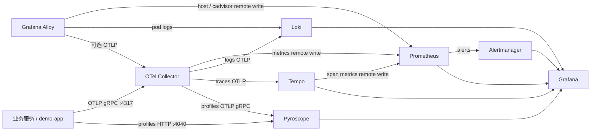

# 架构

这份文档说明每个组件负责什么、数据怎么流、以及本地和 Kubernetes 为什么可以共用同一套配置文件。操作步骤在仓库根目录的 README。

## 组件职责

| 组件 | 角色 |
| --- | --- |
| 业务进程里的 OpenTelemetry SDK | 产生 traces、metrics、logs。Demo 另外用 Pyroscope SDK 推 profiles。 |
| Grafana Alloy | 节点代理。采集主机指标；在 Kubernetes 上再采集本节点容器日志和 cAdvisor。可选接收 OTLP 并转发给 Collector。 |
| OpenTelemetry Collector | 集群网关。接收应用 OTLP，分别写入 Prometheus、Loki、Tempo、Pyroscope。 |
| Prometheus | 指标存储、记录规则、告警规则。开启 remote write receiver 和 exemplar。 |
| Alertmanager | 按严重级别分组、抑制，并决定通知到哪里。 |
| Loki | 单二进制日志存储，保留 7 天，直接接收 OTLP。 |
| Tempo | 单二进制链路存储。块保留保持 Tempo 3 的默认 14 天，并生成 span metrics / service graph 写回 Prometheus。 |
| Pyroscope | 单二进制 profile 存储。原生 HTTP ingest 和 OTLP gRPC（4040）都可以收。 |
| Grafana | 数据源、仪表盘、一条 Grafana 管理的告警规则。告警主路径仍然是 Prometheus + Alertmanager。 |

本地 Docker Compose 和 Kubernetes 使用同一批 `config/` 文件。两边的服务名保持一致（`prometheus`、`loki`、`tempo`、`pyroscope`、`otel-collector`、`alertmanager`、`grafana`、`alloy`、`demo-app`），所以配置里的 DNS 不用分两份。

Alloy 是唯一按环境拆开的配置：`config/alloy/config.alloy` 给 Compose，`config/alloy/config.k8s.alloy` 给 DaemonSet。远端地址相同，差别只在服务发现。

## 数据流

应用指标不走 Prometheus scrape。Collector 把 OTLP histogram 转成 Prometheus 远程写入，资源属性 `service.name` 会变成标签 `service_name`。这样业务接入只需要一个 OTLP 端点。

平台自身的 `/metrics` 仍由 Prometheus 静态抓取，用来回答「Prometheus、Loki、Collector 自己是否还活着」。

## 信号约定

- 服务名：资源属性 `service.name`，Prometheus / Pyroscope 标签 `service_name`，Loki 索引标签同样是 `service_name`（Loki 会把 OTLP 属性名里的点换成下划线）。
- 环境：`deployment.environment`。Compose 里 demo 设为 `local`，Kustomize dev/prod overlay 分别是 `dev` 和 `prod`。
- HTTP 延迟直方图：`http.server.request.duration`，单位秒。落到 Prometheus 后是 `http_server_request_duration_seconds`。
- 标签：`http_route`、`http_request_method`、`http_response_status_code`。
- 日志正文是一行 JSON，里面有 `trace_id`。Grafana 的 Loki 数据源用这个字段跳到 Tempo。
- Profile 的 `service_name` 标签和 trace 的 `service.name` 对齐，Tempo 数据源因此能跳到 Pyroscope。

`/healthz` 会打点和打 span，但记录规则和 SLO 告警把它排除在外，避免探针稀释错误预算。

## 不在这套单机拓扑里的东西

- 没有副本和没有对象存储。Loki、Tempo、Pyroscope、Prometheus 都是单进程加本地盘。
- 后端之间没有 mTLS，remote write 也没有鉴权。
- Collector 的 profiles 管道在 0.161 里仍是 alpha，启动参数带 `service.profilesSupport`。
- Demo 的 profile 主路径是 Pyroscope SDK 的 HTTP push。OTLP profiles 管道留给已经能导出 OTLP profile 的运行时。

生产化时换成上游 Helm（见 README「五层和后续演进」），不要把这份单二进制配置扩成多副本。

## 五层监控

同一套 Prometheus 和同一批 `config/` 文件覆盖五层，不另起一套监控产品。

| 层 | 数据从哪来 | 规则和仪表盘 |
| --- | --- | --- |
| 基础 | node_exporter job `node`；Alloy unix 是 job `alloy-unix` 的副本；Kubernetes 上 cAdvisor 与 kube-state-metrics | `infrastructure` 告警组，仪表盘 UID `infrastructure` |
| 中间件 | Redis、PostgreSQL、Nginx、Kafka 的 exporter，静态抓取 | `middleware` 组，UID `middleware` |
| 应用 | demo 的 OTLP 直方图、在途请求、进程运行时 | `http-red` 与 SLO，UID `application` |
| 业务 | demo 的 `business.*` 仪器，标签允许表在应用和 Collector | `business` 组，UID `business` |
| 自身 | 各组件 `/metrics`，Collector `8888` | `meta-pipeline` 组，UID `meta` |

kube-state-metrics 只在 Kubernetes 上由 Alloy 远程写入。Compose 的 Prometheus 配置不写这个目标，避免没有 API server 时 `TargetDown` 一直响。
