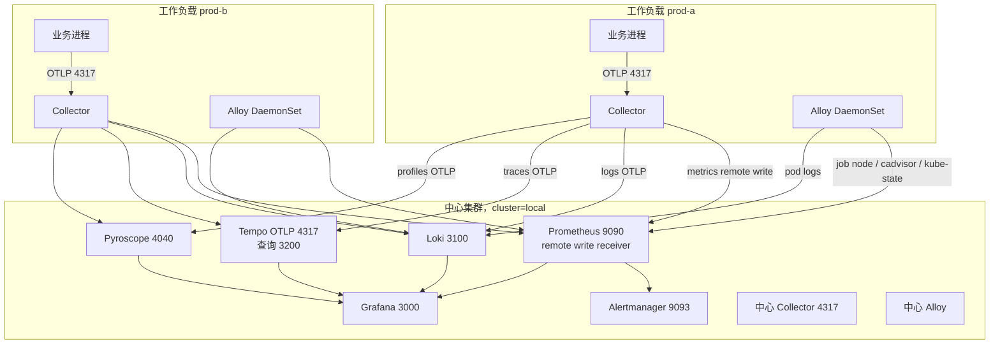

# 多集群

中心只有一套可观测栈。工作负载集群各自跑采集 agent，把指标、日志、链路和 Profile 送到这套栈，并带上标签 `cluster`。中心进程仍是单副本、本地盘。这份文档不把 Prometheus 拆成 Mimir，也不打开对象存储。

## 拓扑



Compose 是这个图的中心栈缩在一台机器上。没有第二个 kubeconfig。`deploy/docker-compose/docker-compose.yml` 把 `CLUSTER_NAME` 设为 `local`，把 URL 设为 Docker 网络里的服务名。Agent 文件 `config/alloy/config.alloy` 读的是同一批环境变量，所以本地管道和工作负载管道是同一份 River，只是地址不同。

| 信号 | 谁发送 | 中心地址 | Compose 默认 |
| --- | --- | --- | --- |
| 指标 | Alloy remote write，Collector `prometheusremotewrite` | `PROMETHEUS_REMOTE_WRITE_URL` | `http://prometheus:9090/api/v1/write` |
| 容器日志 | Alloy `loki.write` | `LOKI_PUSH_URL` | `http://loki:3100/loki/api/v1/push` |
| 应用日志 | Collector `otlphttp/loki` | `LOKI_OTLP_ENDPOINT` | `http://loki:3100/otlp` |
| 链路 | Collector `otlp/tempo` | `TEMPO_OTLP_ENDPOINT` | `tempo:4317` |
| OTLP Profile | Collector `otlp/pyroscope` | `PYROSCOPE_OTLP_ENDPOINT` | `pyroscope:4040` |
| Pyroscope SDK | 应用进程 | `PYROSCOPE_HTTP_URL` | `http://pyroscope:4040` |

Collector 在 0.161 上对 Profile 管道只用 `memory_limiter`。`resource/cluster` 加在 metrics、logs、traces 上。Pyroscope SDK 的 `cluster` tag 由应用的 `CLUSTER_NAME` 设置，默认 `local`。

中心 Prometheus 必须带着 `--web.enable-remote-write-receiver` 启动。Compose 和 `deploy/kubernetes/base/prometheus.yaml` 已经这么写。

这些 URL 在示例 tfvars 里是 `http://prometheus.central.example.invalid:9090/api/v1/write` 这一类。`.invalid` 不会解析到真实主机。接到网络上时换成中心集群的内网地址或内部负载均衡，不要换成公网地址。Collector 的 `tls.insecure: true` 表示明文 HTTP。换成 HTTPS 时要改 `config/otel-collector/config.yaml` 的 tls 段，不要把证书提交进 git。

## 标签合同

| 标签 | 基数 | 谁写上 | 禁止 |
| --- | --- | --- | --- |
| `cluster` | 每个集群一个值 | 中心抓取的 relabel 写 `local`；工作负载在 remote write / 资源属性上写 map 的键 | Pod uid、用户 id、请求 id、节点 IP |
| `service_name` | 每个服务一个值 | 应用资源属性 `service.name` | 把实例 id 塞进服务名 |
| `deployment_environment` | 少量环境名 | 应用或 overlay | 按发布号无限增加 |
| `namespace`、`pod`、`container` | 日志流需要，受集群规模限制 | Alloy 日志发现 | `pod_uid` |
| `instance`（node job） | 每个节点一个值 | 中心静态目标是 `node-exporter:9100`；工作负载 agent 写成节点名 | Pod IP |

中心 Prometheus 的 `metric_relabel_configs` 只作用于它自己抓取的目标。别的集群 remote write 进来的样本已经带着 `cluster`，接收端不会改写它。

记录规则使用 `sum by (cluster, service_name)` 这种形式。没有 `cluster` 标签的旧序列仍然能聚合，单元测试覆盖了这一点。有 `cluster` 时，prod-a 和 prod-b 不会加成一条线。

五层仪表盘的模板变量 `cluster` 默认是 `local`。Compose 只有这一个值，面板和改动前一样有数。中心 Prometheus 里出现其它集群后，变量查询 `label_values(cluster)` 会列出它们。

Alertmanager 按 `alertname`、`cluster`、`service_name`、`namespace`、`job` 分组。prod-a 的 critical 不会抑制 prod-b 的 warning。

## 网络路径

工作负载集群必须能主动访问中心的这些端口：

| 端口 | 协议 | 用途 |
| --- | --- | --- |
| 9090 | HTTP | Prometheus remote write，路径 `/api/v1/write` |
| 3100 | HTTP | Loki push `/loki/api/v1/push`，以及 OTLP `/otlp` |
| 4317 | gRPC | Tempo OTLP。查询端口 3200 给 Grafana，agent 不需要 |
| 4040 | gRPC 与 HTTP | Pyroscope。OTLP profiles 和 SDK HTTP 都在这个端口 |

中心集群的 Grafana 3000、Alertmanager 9093 不需要向工作负载集群开放。应用只访问本集群的 Collector `4317` / `4318`。NetworkPolicy `observability-default` 允许任意命名空间访问这两个端口，出站目前全开，所以 agent 能访问中心地址，也能访问 API server。收紧出站之前先把中心网段留在允许列表里，否则 remote write 会失败，表现是 `AlloyRemoteWriteFailures` 和 Collector 的 `CollectorExportFailures`。

中心节点上的 node-exporter 仍是一个 Service。多节点的中心集群不能靠这个 Service 看到每一台机器。工作负载集群已经按节点抓取。中心侧要多节点时，用同样的发现规则，不要把 `alloy-unix` 改名为 `node`。

## 一个集群没有出现

按这个顺序看，不要先改仪表盘。

1. 确认 Terraform 里该集群 `enabled = true`，并且 `terraform apply` 没有报错。`module.workload` 的输出 `workload_clusters` 应包含这个名字。
2. 在该集群执行 `kubectl -n observability get pods`。Alloy 和 `otel-collector` 应 Ready。ConfigMap `observability-endpoints` 的 `CLUSTER_NAME` 必须是这个集群的名字，URL 必须是中心地址，而不是 `http://prometheus:9090`。
3. 看 Alloy 日志里的 remote write 错误，或中心 Prometheus 上的 `prometheus_remote_storage_samples_failed_total{job="alloy",cluster="<名字>"}`。连接被拒绝说明网络或端口。404 说明 URL 路径不是 `/api/v1/write`。
4. 在中心 Prometheus 执行 `count by (cluster) (up)`。没有这个 `cluster` 值，说明样本没到中心，或者到了但没带标签。后者检查 Alloy 的 `CLUSTER_NAME` 是否为空。`sys.env` 在变量缺失时返回空字符串，空标签等于没有身份。
5. 应用指标还要看本集群 Collector 是否导出。Collector 自身指标在中心侧是 remote write 进来的 `otelcol_*`，带同一个 `cluster`。中心集群自己的 Collector 由中心 Prometheus 抓取 `:8888`，标签是 `local`。
6. Grafana 变量选了 `local` 时，工作负载的线不会出现。把变量改成该集群的名字。

日志用 `{cluster="prod-a"}`。链路在 Tempo 里看资源属性 `cluster`。span metrics 只有在 trace 上带了这个资源属性之后才会出现 `cluster` 标签。Collector 的 `resource/cluster` 会在导出前写上，所以经过本集群 Collector 的 trace 会有。

## 跨集群的数据倾斜

倾斜在这里的样子是：中心 Prometheus 或 Loki 变慢，但只有一个 `cluster` 的序列数或日志流在涨。

指标：

```promql
topk(5, count by (cluster) ({__name__=~".+"}))
```

这个查询很贵，时间范围放短。比较健康的形状是每个 `cluster` 一块稳定的序列，和节点数、服务数成比例。不健康的形状是某一个集群阶跃，其它集群不动。常见原因是那个集群新加了 Pod IP、用户 id 或原始 URL。`cluster` 本身只有一个值，不会造成这个阶跃。

然后缩小到那个集群：

```promql
topk(10, count by (__name__) ({cluster="prod-a"}))
```

日志侧，Loki 仍是单租户。流的差别在标签组合。`{cluster="prod-a"}` 的流数远高于 `{cluster="prod-b"}` 时，先看 prod-a 有没有把 trace id 或用户 id 放进 stream label。索引里允许的低基数标签包括 `cluster`，不包括 pod uid。

告警 `PrometheusHighSeries` 和 `LokiStreamChurn` 看的是中心进程。它们响的时候，先按 `cluster` 拆开，再决定是哪一个工作负载在写垃圾标签。不要把阈值调高来盖住某一个集群。

采样偏差也会按集群分开。Tempo 的尾部采样在每个集群自己的 Collector 上执行（`config/otel-collector/config.yaml` 的 `tail_sampling`）。某个集群把 `sampling_percentage` 改低之后，那个集群的 Tempo 错误 trace 会显得更多，但中心 Prometheus 里 `http_server_request_duration_seconds_count{cluster="那个集群"}` 的 5xx 比例不一定同样升高。对比时一定带上 `cluster`，否则会把采样更狠的集群和全量集群加在一起。
